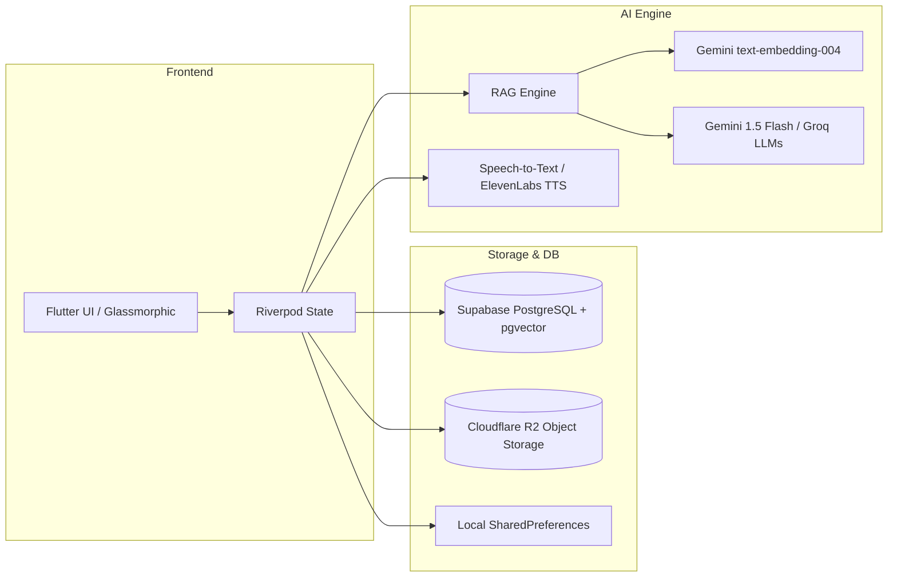

# Project Proposal: AI Study Companion
**A Retrieval-Augmented Generation (RAG) Powered Personalized Learning Platform**

---

### 1. Problem Statement

In higher education, university and college students face significant friction managing, synthesizing, and studying from vast volumes of academic material. Throughout a semester, academic content is scattered across disparate formats—multi-gigabyte textbook PDFs, lecture slide decks, syllabus outlines, lab manuals, and personal notes. This fragmented workflow creates several severe challenges:

* **Inefficient Manual Retrieval:** Finding specific concepts, derivations, or problem-solving methods inside dense 500+ page textbook PDFs or 50-slide lecture decks is tedious and time-consuming, especially during pre-exam crunch periods.
* **Limitations and Hallucinations of Generic AI Assistants:** While students increasingly rely on general-purpose AI chatbots (e.g., standard ChatGPT), these generic models lack access to the student's specific syllabus, professor-assigned conventions, and course lecture notes. Consequently, generic LLMs generate responses that are either out-of-syllabus, mathematically unverified, or plagued by plausible-sounding hallucinations that students cannot reliably cross-verify.
* **Lack of Grounded Source Citations:** Standard AI tools cannot point students to the exact slide or textbook page where a concept was taught, eroding academic trust and making deep fact-checking laborious.
* **Manual Assessment Overhead:** Effective learning techniques—such as self-testing (quizzing) and spaced repetition (flashcards)—require substantial manual preparation. Students spend more time assembling revision aids than actively studying.
* **Absence of Pedagogical Adaptability:** Traditional digital documents are passive. They do not adapt explanations to the student's background knowledge, engage them through guided Socratic inquiry, or diagnose specific conceptual weaknesses.

**The Gap:** There is a critical lack of a unified, offline-resilient academic study environment that bridges the gap between private course materials and conversational AI—one that ensures every generated answer is strictly grounded in the student's curriculum with verifiable citations.

---

### 2. Objective

#### 2.1 What we aim to solve
The primary goal of **AI Study Companion** is to transform passive, scattered course materials into an interactive, grounded, and personalized digital tutor. Rather than replacing study materials, the system ingests them to deliver a curriculum-aligned learning experience.

**Specific Objectives:**
* **Develop Course-Specific Knowledge Bases:** Allow students to organize materials by course and semester, isolating vector knowledge bases to prevent cross-subject contamination.
* **Implement a Verifiable RAG Pipeline:** Build an automated pipeline that parses documents, chunks content, generates vector embeddings, and performs hybrid search (semantic vector similarity + keyword matching) to extract relevant context.
* **Provide Grounded Answers with Page-Level Citations:** Ensure the AI assistant answers queries using the student's exact course slides or textbooks, displaying verifiable document titles, page numbers, and context snippets.
* **Support Dynamic Pedagogical Modes:** Equip the tutor with multiple teaching modes (Direct Academic, Socratic Guided Questioning, Beginner Analogies, and High-Yield Exam Review).
* **Automate Formative Self-Assessment:** Generate contextual multiple-choice quizzes and spaced-repetition flashcards directly from the ingested lecture notes.
* **Deliver Personalized Memory and Study Management:** Provide persistent student memory (remembering individual learning preferences and past weak areas) coupled with an adaptive daily study schedule.

#### 2.2 How we plan to solve it
To accomplish these objectives, we employ a modern, decoupled client-server architecture utilizing **Retrieval-Augmented Generation (RAG)**, vector databases, and cross-platform mobile engineering:

* **Technology Stack:**
  * **Frontend Application:** Built with **Flutter & Dart** for cross-platform deployment across Android, iOS, and Desktop.
  * **State Management:** **Riverpod** ensuring modular, reactive state with dual-layer caching (local disk persistence via `SharedPreferences` + remote cloud sync).
  * **Backend & Vector Database:** **Supabase (PostgreSQL)** utilizing the **`pgvector`** extension with HNSW indexing for cosine similarity retrieval on 768-dimensional embeddings.
  * **Object Storage:** **Cloudflare R2** (S3-compatible via SigV4) for cost-effective, high-throughput storage of raw PDF files and user assets.
  * **Artificial Intelligence Layer:** **Google Gemini 1.5 Flash** as the primary conversational LLM paired with **Gemini `text-embedding-004`** for semantic vectors; **Groq API** (`llama-3.3-70b`, `qwen3.6-27b`) as high-speed inference fallbacks.
  * **Math & Markdown Rendering:** **`flutter_math_fork`** for LaTeX mathematical equations and **`flutter_markdown_plus`** for formatted text, code blocks, and tables.
  * **Audio & Voice:** **Speech-to-Text** for voice input and **ElevenLabs API** / platform TTS for auditory learning.

* **Development Process (Agile Methodology):**
  * **Sprint 1 (Core RAG & Ingestion):** Build document upload, semantic chunking, vector embedding generation, and pgvector storage.
  * **Sprint 2 (Grounded AI Tutor & Citations):** Develop the chat interface, hybrid similarity retrieval, prompt orchestration, LaTeX equation display, and verifiable citation modals.
  * **Sprint 3 (Study Tools & Assessment):** Implement automated quiz generation, interactive scoring, spaced-repetition flashcard deck, and daily study task planning.
  * **Sprint 4 (Personalization, Memory, & Polish):** Implement ChatGPT-style persistent AI memories, user profiles, theme toggles, audio synthesis, and offline-first fallback synchronization.

---

### 3. Features of Your Idea

● **Course-Based Knowledge Bases:** Students organize academic materials into dedicated course containers (e.g., *CSE331: Computer Architecture*), ensuring queries retrieve context only from relevant course materials.

● **Grounded RAG AI Tutor with Source Citations:** Students query their course materials using natural language. The system retrieves the most relevant excerpts and generates structured answers complete with clickable citation chips showing the source document name and page number.

● **Multi-Pedagogical Learning Modes:** Students can toggle between distinct tutoring approaches on the fly:
  * *Direct Tutor:* Detailed academic answers with bullet points, comparisons, and tables.
  * *Socratic Mode:* The AI guides the student with diagnostic follow-up questions rather than giving immediate answers.
  * *Beginner Mode:* Simplifies abstract theories using real-world analogies and plain language.
  * *Exam Mode:* Focuses strictly on high-yield exam takeaways, formulas, and scoring criteria.

● **Mathematical LaTeX & Syntax Highlighting:** Specialized rendering for STEM disciplines, formatting complex mathematical derivations into clean LaTeX equation blocks alongside highlighted code snippets.

● **Persistent AI Student Memory:** A customizable memory module where the AI records and adheres to student study preferences, academic strengths, and target goals across different sessions.

● **AI-Generated Interactive Quizzes:** Automatically generates multiple-choice quizzes directly from uploaded lecture slides, complete with immediate answer evaluation, detailed rationale, and score tracking.

● **Spaced-Repetition Flashcards:** Digital flip-card decks generated from lecture summaries to facilitate active recall and long-term concept retention.

● **Adaptive Study Planner & Task Schedule:** A structured daily schedule that breaks semester workloads into *Today*, *Tomorrow*, and *Upcoming* study tasks, tracking overall course mastery percentages.

● **Multimodal Voice Interaction:** Hands-free study capability featuring speech-to-text voice dictation and text-to-speech audio playback via ElevenLabs and local TTS engines.

---

### 4. Conclusion

**AI Study Companion** redefines how university students interact with academic materials by pairing modern cross-platform mobile engineering with Retrieval-Augmented Generation. By restricting generative AI to students' verified course materials, the platform directly addresses the critical problems of hallucination, lack of verification, and scattered document management. 

**Expected Impact & Benefits:**
* **Accelerated Revision:** Reduces the time required to locate key concepts across large textbook files and slide decks.
* **Trust & Academic Integrity:** Ensures every answer is verifiable through page-level citations.
* **Enhanced Retention:** Combines conversational inquiry with proven learning techniques like active recall (quizzes) and spaced repetition (flashcards).
* **Democratized 1-on-1 Tutoring:** Provides every student with a tireless, 24/7 personal tutor tailored to their specific university syllabus.

**Future Scope & Enhancements:**
* **Handwritten OCR & Multimodal Ingestion:** Processing photographed whiteboard drawings, handwritten notes, and lecture diagrams.
* **Interactive Knowledge Graphs:** Visual mapping of concept dependencies and prerequisite topic trees across a semester.
* **Mock Exam Simulator:** Timed examination sessions with rubric-based automated grading and personalized gap-analysis reports.
* **LMS Integration:** Direct synchronization with university platforms such as Canvas, Moodle, and Google Classroom.
